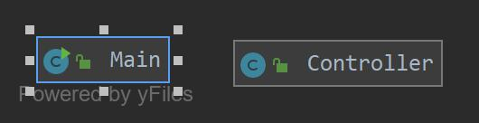

# Project Title
Production Line Manager - OOP Project
## Demonstration
Coming soon
## Documentation
Coming soon
## Diagrams

## Getting Started
There are three tabs at the top of the application: Product Line, Produce, and 
Production Log.
On the Product Line tab, a user shall enter a product type, product name,
and a manufacturer. The 'add product' button submits that data to the database to be stored.
Second and third tabs cmoming soon.

## Built With
Language: Javafx \
IDE: IntelliJ Ultimate Edition \
Other tools: Scenebuilder, H2 database
## Contributing
Professor Vanselow contibutes in class and via his website
## Author
Peter J Look II - SID: 815 192 220
## License
n/a
## Acknowledgments
https://sites.google.com/site/profvanselow/course/cop-3003/oop-project\
https://github.com/PV-COP/PV-README-TEMPLATE
## History
Coming soon...
## Key Programming Concepts Utilized
Javafx, scenebuilder, H2 database, SQL, object oriented paradigm